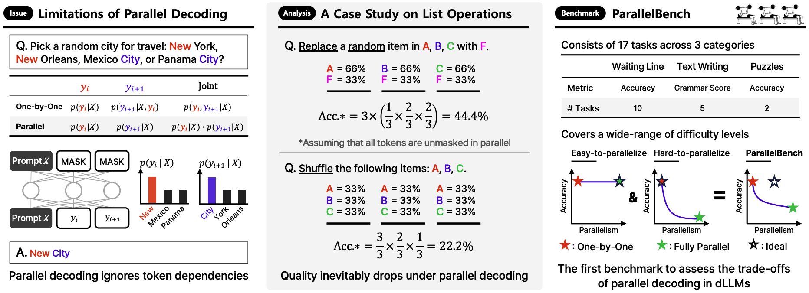

# ParallelBench: Understanding the Tradeoffs of Parallel Decoding in Diffusion LLMs


<p align="center">
      <a href="https://scholar.google.com/citations?user=Q-ARWkwAAAAJ&hl=eh" target="_blank">Wonjun Kang</a><sup>*1,5</sup>, 
      <a href="https://scholar.google.com/citations?user=G1EpeWYAAAAJ&hl=en" target="_blank">Kevin Galim</a><sup>*1</sup>, 
      <a href="https://scholar.google.com/citations?user=IXJcR1gAAAAJ&hl=en" target="_blank">Seunghyuk Oh</a><sup>*1</sup>, 
      <a href="https://scholar.google.com/citations?user=XJXKp60AAAAJ&hl=en" target="_blank">Minjae Lee</a><sup>1</sup>, 
      <a href="https://yzeng58.github.io/zyc_cv/" target="_blank">Yuchen Zeng</a><sup>2,3</sup>, 
      <a href="https://scholar.google.com/citations?user=jkXzD7YAAAAJ&hl=en" target="_blank">Shuibai Zhang</a><sup>2</sup>, 
      <a href="https://scholar.google.com/citations?user=si-368wAAAAJ&hl=en" target="_blank">Coleman Hooper</a><sup>4</sup>, 
      <a href="https://yuezhouhu.github.io/" target="_blank">Yuezhou Hu</a><sup>4</sup>, 
      <a href="https://scholar.google.com/citations?user=Oyy8aDMAAAAJ&hl=en" target="_blank">Hyung Il Koo</a><sup>1</sup>, 
      <a href="https://ece.snu.ac.kr/en/research-faculty/faculty/fulltime?md=view&profid=p041" target="_blank">Nam Ik Cho</a><sup>5</sup>, 
      <a href="https://kangwooklee.com/aboutme/" target="_blank">Kangwook Lee</a><sup>2,6</sup>
  </p>
  <p  align="center">
    <sup>1</sup>FuriosaAI, <sup>2</sup>UW-Madison, <sup>3</sup>Microsoft Research, <sup>4</sup>UC Berkeley, <sup>5</sup>Seoul National University, <sup>6</sup>KRAFTON AI
   </p>
<p align="center">
    <a href="https://parallelbench.github.io/">
        
    </a>
    <a href="https://arxiv.org/abs/2510.04767">
        
    </a>
</p>

<p align="center">

</p>

## 🚀 Overview
Diffusion LLMs (dLLMs) promise faster generation via parallel decoding. However, this speed often comes at the cost of quality, as they ignore token dependencies, an issue that existing benchmarks do not sufficiently capture. To address this issue, we introduce **ParallelBench**, the first benchmark designed to rigorously test this trade-off through realistic tasks that humans and autoregressive (AR) LLMs can easily solve, but which cause dLLMs to collapse as parallelism grows. We release **ParallelBench** to drive research towards truly efficient dLLMs that can overcome this challenge.

<details>
<summary>📝 <b>Abstract</b></summary>
While most autoregressive LLMs are constrained to one-by-one decoding, diffusion LLMs (dLLMs) have attracted growing interest for their potential to dramatically accelerate inference through parallel decoding. Despite this promise, the conditional independence assumption in dLLMs causes parallel decoding to ignore token dependencies, inevitably degrading generation quality when these dependencies are strong. However, existing works largely overlook these inherent challenges, and evaluations on standard benchmarks (e.g., math and coding) are not sufficient to capture the quality degradation caused by parallel decoding. To address this gap, we first provide an information-theoretic analysis of parallel decoding. We then conduct case studies on analytically tractable synthetic list operations from both data distribution and decoding strategy perspectives, offering quantitative insights that highlight the fundamental limitations of parallel decoding. Building on these insights, we propose **ParallelBench**, the first benchmark specifically designed for dLLMs, featuring realistic tasks that are trivial for humans and autoregressive LLMs yet exceptionally challenging for dLLMs under parallel decoding. Using ParallelBench, we systematically analyze both dLLMs and autoregressive LLMs, revealing that: (i) dLLMs under parallel decoding can suffer dramatic quality degradation in real-world scenarios, and (ii) current parallel decoding strategies struggle to adapt their degree of parallelism based on task difficulty, thus failing to achieve meaningful speedup without compromising quality. Our findings underscore the pressing need for innovative decoding methods that can overcome the current speed-quality trade-off. We are releasing our benchmark to help accelerate the development of truly efficient dLLMs.
</details>

## 🌟 Features

- **Information-Theoretic Analysis:**
Proves that parallel decoding has fundamental error bounds when tokens depend on each other, showing even perfect models struggle as we increase parallelism on tasks requiring strong token coordination.

- **Quantitative Case Studies:**
Analytically tractable synthetic list operations (Copy, Replace, Shuffle) with closed-form accuracy formulas demonstrate fundamental limitations: specific tasks show inevitable quality degradation under parallel decoding.

- **Realistic Benchmark Tasks:**
17 tasks across Waiting Line, Text Writing, and Puzzles—all trivial for humans and AR LLMs—reveal severe quality degradation in dLLMs under parallel decoding in real-world scenarios.

***

## ⚙️ Setup

These steps will guide you through setting up the necessary environment and dependencies.

### 1. Prerequisites
- **Conda**: For managing the environment.
- **NVIDIA GPU**: CUDA >= 11.8.
- **Java Development Kit (JDK)**: Required only for grammar-based evaluation metrics.

### 2. Create Conda Environment
First, create and activate the conda environment. We use **Python 3.10**.

```bash
conda create -n parallelbench python=3.10 -y
conda activate parallelbench
```

### 3. Install Python Dependencies
We use `uv` for faster package installation. The following commands will install PyTorch, `vLLM` for the LLM baselines, and all other required packages from `requirements.txt`.

```bash
# Install uv, a fast package installer
pip install uv

# Install core dependencies
uv pip install torch==2.6.0 --index-url https://download.pytorch.org/whl/cu118
uv pip install -r requirements.txt
uv pip install vllm  # optional for LLM evaluation
```

### 4. Install Java (Optional)
If you need to run the grammar-based evaluations, install the JDK via conda:
```bash
conda install -c conda-forge openjdk=17
```

***

## ⚡ Quickstart
Here's a simple example of how to load a model and run it on a **ParallelBench** task. For a more in-depth example, see the [`demo.py`](demo.py) script.

<details>
<summary>📋 <b>View Available Tasks</b></summary>

* 🔄 **Waiting Line**
    * `waiting_line/copy`
    * `waiting_line/insert_index`
    * `waiting_line/insert_random`
    * `waiting_line/remove_index`
    * `waiting_line/remove_random`
    * `waiting_line/replace_index`
    * `waiting_line/replace_random`
    * `waiting_line/reverse`
    * `waiting_line/shuffle`
    * `waiting_line/sort`
* ✍️ **Text Writing**
    * `paraphrase_summarize/chatgpt-paraphrases`
    * `paraphrase_summarize/samsum`
    * `words_to_sentence/easy`
    * `words_to_sentence/medium`
    * `words_to_sentence/hard`
* 🧠 **Puzzle**
    * `puzzle/latin_square_n4`
    * `puzzle/sudoku_n4_12`

</details>

```python
import torch
from transformers import AutoModel, AutoTokenizer
from dataset.parallel_bench import ParallelBench

# 1. Load the model and tokenizer
model = AutoModel.from_pretrained(
    "Dream-org/Dream-v0-Instruct-7B",
    trust_remote_code=True,
    torch_dtype=torch.bfloat16
).cuda()

tokenizer = AutoTokenizer.from_pretrained(
    "Dream-org/Dream-v0-Instruct-7B",
    trust_remote_code=True
)

# 2. Load a benchmark task and get a sample
task_name = "waiting_line/copy"
dataset = ParallelBench(task_name)
sample = dataset[0] # Get the first sample from the task

# 3. Prepare input from the benchmark sample
messages = sample["input"]["messages"]
input_ids = tokenizer.apply_chat_template(
    messages,
    add_generation_prompt=True,
    return_tensors="pt"
).to(model.device)

# 4. Generate the model's output
generated_ids = model.diffusion_generate(input_ids, max_tokens=32)
response = tokenizer.decode(generated_ids[0][len(input_ids[0]):], skip_special_tokens=True)

# 5. Compare the model's output with the reference label
print(f"Task: {task_name}")
print(f"Prompt: {messages[-1]['content']}")
print(f"Reference Label: {sample['label']}")
print(f"Model Output:    {response}")

# To get the final score, run compute_metrics
metrics = dataset.compute_metrics([response], [sample["label"]])
print(f"Metrics: {metrics}")
```

***

## 🛠️ Create Your Own Tasks

You can easily generate custom tasks from YAML configuration files. For example, to create new `copy` and `reverse` tasks:

```bash
PYTHONPATH=. python dataset/parallel_bench/data/task.py --task test/copy_reverse/all
```

This command uses the configurations specified in `dataset/parallel_bench/data/task_configs/`.


***

## 🚀 Running Evaluations


### 🔑 Configuration

Before running the evaluations, you must export the necessary API keys as environment variables.

```bash
# For logging results
export WANDB_API_KEY="your_weights_and_biases_key"

# For commercial model APIs
export ANTHROPIC_API_KEY="your_anthropic_key"      # For Haiku
export INCEPTION_API_KEY="your_mercury_model_key"  # For Mercury
```

All experiments are launched using the `run_all.py` script. The general command structure is:
```bash
python run_all.py eval.py --device <gpu_ids> --cfg <path_to_config_file>
```

### Main Benchmark Reproduction
This section covers the commands to reproduce the main benchmark results from our paper. The following commands run evaluation on **two GPUs**.

- **LLaDA 1.5**:
  ```bash
  python run_all.py eval.py --device 0 1 --cfg cfg/paper/benchmark/llada_1_5_all_tasks_list.yaml
  ```
- **Dream**:
  ```bash
  python run_all.py eval.py --device 0 1 --cfg cfg/paper/benchmark/dream_all_tasks_list.yaml
  ```
- **Diffucoder**:
  ```bash
  python run_all.py eval.py --device 0 1 --cfg cfg/paper/benchmark/diffucoder_all_tasks_list.yaml
  ```
- **LLaDA 1.0**:
  ```bash
  python run_all.py eval.py --device 0 1 --cfg cfg/paper/benchmark/llada_1_0_all_tasks_list.yaml
  ```

### dLLM vs. Autoregressive LLM Comparison
This section includes the commands for the comparative analysis between our models and other strong LLM baselines.

- **LLaDA 1.5**:
  ```bash
  python run_all.py eval.py --device 0 1 --cfg cfg/paper/dllm_vs_llm/llada_1_5_all_tasks_list.yaml
  ```
- **Dream**:
  ```bash
  python run_all.py eval.py --device 0 1 --cfg cfg/paper/dllm_vs_llm/dream_all_tasks_list.yaml
  ```
- **Diffucoder**:
  ```bash
  python run_all.py eval.py --device 0 1 --cfg cfg/paper/dllm_vs_llm/diffucoder_all_tasks_list.yaml
  ```
- **LLaDA 1.0**:
  ```bash
  python run_all.py eval.py --device 0 1 --cfg cfg/paper/dllm_vs_llm/llada_1_0_all_tasks_list.yaml
  ```
- **Mercury** (requires single GPU):
  ```bash
  python run_all.py eval.py --device 0 --cfg cfg/paper/dllm_vs_llm/mercury_all_tasks_list.yaml
  ```
- **Haiku** (requires single GPU):
  ```bash
  python run_all.py eval.py --device 0 --cfg cfg/paper/dllm_vs_llm/haiku_all_tasks_list.yaml
  ```
- **LLM Baselines** (via vLLM):
  ```bash
  python run_all.py eval.py --device 0 1 --cfg cfg/paper/dllm_vs_llm/llm_all_tasks_list.yaml
  ```


### 📊 Results

All evaluation metrics and generated outputs are logged to **Weights & Biases (wandb)**. Please ensure you have configured your API key and project settings.

***

## 🙏 Acknowledgements
This project builds upon the work of several fantastic open-source repositories. We extend our sincere thanks to the original authors for their contributions to the community.

- [LLaDA](https://github.com/ML-GSAI/LLaDA)
- [Dream](https://github.com/DreamLM/Dream)
- [Fast-dLLM](https://github.com/NVlabs/Fast-dLLM)
- [ReMDM](https://github.com/guanghanwang/ReMDM-LLaDA)
- [RCR](https://github.com/autonomousvision/mdpo)
- [Score-Entropy-Discrete-Diffusion](https://github.com/louaaron/Score-Entropy-Discrete-Diffusion)

## 📖 Citation
```bibtex
@article{kang2025parallelbench,
  title={ParallelBench: Understanding the Trade-offs of Parallel Decoding in Diffusion LLMs},
  author={Kang, Wonjun and Galim, Kevin and Oh, Seunghyuk and Lee, Minjae and Zeng, Yuchen and Zhang, Shuibai and Hooper, Coleman and Hu, Yuezhou and Koo, Hyung Il and Cho, Nam Ik and others},
  journal={arXiv preprint arXiv:2510.04767},
  year={2025}
}
```
 
